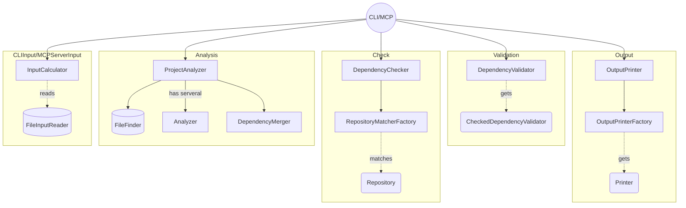

# DepChecker Architecture

The app (CLI and MCP Server) is divided into 5 modules:

## CLIInput/MCPServerInput
These modules are responsible for gathering the input values from the arguments, environment and/or the config file.

## Analysis
This module is responsible for retrieving the external dependencies for a given project (xcodeproj or Package.swift) and a Package.resolved file (optional). After that, it returns a merged collection.

## Check
This module is responsible for resolving the current version and the latest version of each dependency. These processes are executed in parallel. If some of them fail, it does not affect the others.

## Output
This module is responsible for printing the results to the standard output depending on the format. There are two output implementations: JSON and Table. It can be extended for more formats.

## Validation
This module is responsible for validating the retrieved dependencies. If some validation fails, the app process will fail.
